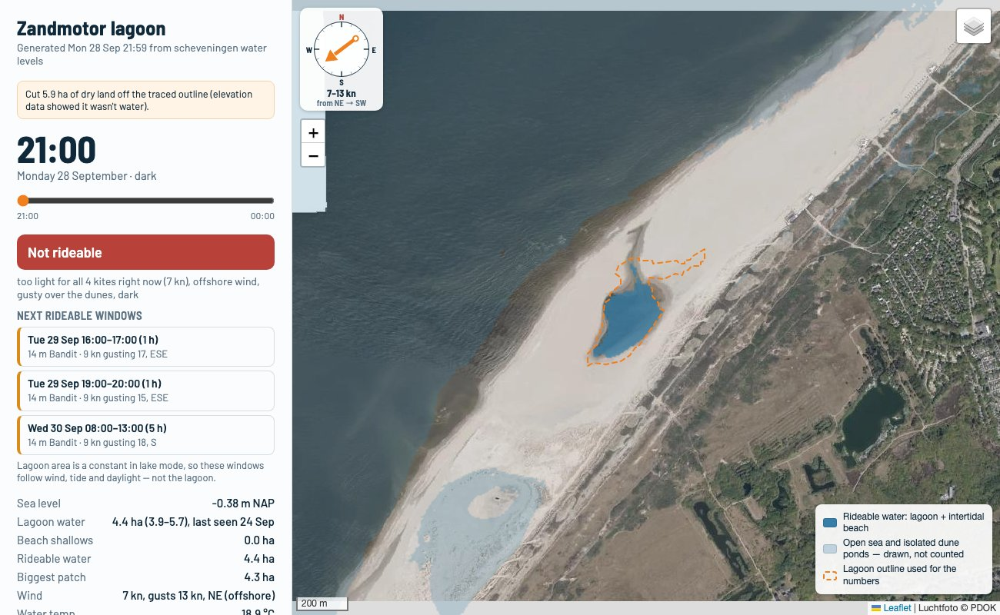

# Zandmotor lagoon

A kitesurfing nowcast for the lagoon on the Zandmotor, the artificial sand peninsula near Kijkduin (The Hague). It builds one self-contained HTML page with a time slider that answers: **is there enough water to ride, does one of my kites fit the wind, and when is the next window?**



> **Not a safety tool.** This is a model estimate. Always check conditions and local kite zones on the spot.

## What the report shows

- **A map** of where there is water, hour by hour. Rideable water (the lagoon plus the intertidal beach) is drawn in full colour. The open sea is drawn paler and is never counted in any total.
- **A verdict per hour**: *Looks rideable*, *Rideable, with caveats* or *Not rideable*, with the reasons.
- **The next rideable windows** across the whole week-long wind forecast.
- **Wind** as a compass rose on the map (the arrow points where the wind blows towards), plus speed, gusts and whether it is onshore, side-shore or offshore.
- **Kite advice from your own quiver**: which of your kites fits right now.
- **Tide**: sea level through the day and the next high and low waters.
- **Water temperature** and which wetsuit to wear.
- **Data sources**: when each input was last pulled, so stale data is visible.

## How it works

| Input | Source | Used for |
|---|---|---|
| Terrain | [AHN](https://www.ahn.nl) elevation via PDOK | which parts of the beach and dunes flood at a given sea level |
| Water level | Rijkswaterstaat (measured, forecast incl. surge, astronomical tide) | tidal flooding of the beach |
| Lagoon | Sentinel-2 (optical) and Sentinel-1 (radar) images via [Copernicus Data Space](https://dataspace.copernicus.eu) | the lagoon's outline and size |
| Wind, air temperature, daylight | [Open-Meteo](https://open-meteo.com) forecast | kite advice and dark hours |
| Water temperature | Open-Meteo marine API | wetsuit advice |

Depth is not modelled. Kiting needs a surface to ride on, not a particular depth, so the only question is whether a spot is wet.

### The lagoon is treated as a slow-moving lake

The lagoon's bed is underwater and can't be measured from elevation data, so its size comes from satellite images instead. `--calibrate` tested a year of images against the tide and against wind gusts. Neither explains how big the lagoon is: at the last calibration (59 images) the correlation was 0.13 with sea level and 0.17 with gusts, where 0 means no relationship.

So the report does not forecast the lagoon. It shows the **median of the recent satellite observations** (last 45 days), with the spread of those observations, and it stays the same for every hour in the slider. The size moves only when new images come in with `--calibrate`. The design notes in [zandmotor_lagoon.py](zandmotor_lagoon.py) record what was tried, including an earlier wind relationship that turned out to be a false positive.

## Install

Requires Python 3.9 or later.

```bash
git clone https://github.com/thijskalshoven/Zandmotor.git
cd Zandmotor
python -m venv .venv
source .venv/bin/activate
pip install -e ".[tide]"        # tide = optional utide fallback for the water level
```

## Usage

```bash
python zandmotor_lagoon.py                      # now + next 8 hours, opens in the browser
python zandmotor_lagoon.py --hours 12 --step 30 # 12 hours in 30-minute steps
python zandmotor_lagoon.py --no-open            # write the page without opening it
python zandmotor_lagoon.py --outline            # re-trace the lagoon outline
python zandmotor_lagoon.py --calibrate          # pull recent satellite images of the lagoon
```

`python -m zandmotor` and the installed `zandmotor` command work the same way. The output is `zandmotor_lagoon.html`, a single file. The numbers work offline; the map needs an internet connection.

A normal run needs no account. It uses the cached lagoon model and fetches tide and wind live. The first run also downloads the terrain, which is then cached.

### Satellite data (optional)

`--calibrate` and `--outline sentinel` need a free [Copernicus Data Space](https://dataspace.copernicus.eu) account. In its dashboard, create an OAuth client (Sentinel Hub) and set:

```bash
export CDSE_CLIENT_ID=...
export CDSE_CLIENT_SECRET=...
```

Run `--calibrate` every week or two. The report warns when the newest lagoon image is more than 14 days old. A run doesn't always find a newer image, because cloudy scenes and radar scenes taken in strong wind are skipped.

### Lagoon outline

`--outline` writes `lagoon.geojson` and a check image, `lagoon_outline_check.png`:

- `sentinel`: traced from a recent cloud-free Sentinel-2 image near high water. Needs the account above.
- `osm`: taken from OpenStreetMap. No account needed, but may be outdated.
- `auto` (default): `sentinel` if credentials are set, otherwise `osm`.

Parts of the traced outline that the elevation data shows are dry land (above 0.5 m NAP) are cut off, and the report says how much. If the wrong water body is picked, set `CFG["lagoon_hint"]` to a point inside the lagoon, or draw the outline on [geojson.io](https://geojson.io) and save it as `lagoon.geojson`.

## Configuration

Everything tunable lives in `CFG` in [zandmotor/config.py](zandmotor/config.py). The parts you will most likely change:

- **`rider`**: weight, height, board and `skill_ceiling_kn`, the strongest gust you want to be out in.
- **`quiver`**: your kites. Each has a size, a photo in `Kites/` and, if known, the manufacturer's wind range for a 75 kg rider (`wind_range_75kg`). Ranges are shifted for your weight and capped at your ceiling. A kite without a chart gets an estimated range, marked **e** in the report. Set `exempt_from_ceiling` on a storm kite that only makes sense above your ceiling.
- **`min_rideable_ha`**: the smallest connected patch of water worth riding (default 3 ha).
- **`local_dem`**: a path to your own elevation GeoTIFF, instead of downloading AHN.

## Project layout

```
zandmotor_lagoon.py      entry point, plus the full design notes
zandmotor/
  cli.py                 argument parsing and run orchestration
  config.py              CFG: every tunable, URL and filename
  flood.py               the flood-mask pipeline
  lagoon_model/          lagoon size model (calibration and runtime)
  satellite/             Copernicus client, Sentinel-2 and Sentinel-1
  terrain.py tides.py wind.py kiting.py windows.py outline.py rendering.py
  html_report/           the HTML template and page assembly
Kites/                   kite photos shown in the quiver section
tests/                   pytest suite (no network needed)
```

`cache/`, `lagoon.geojson`, the `*_check.png` images and `zandmotor_lagoon.html` are generated and not tracked.

## Tests

```bash
pip install -e ".[dev]"
pytest
```
